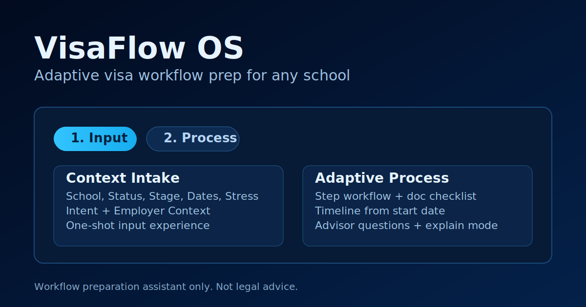
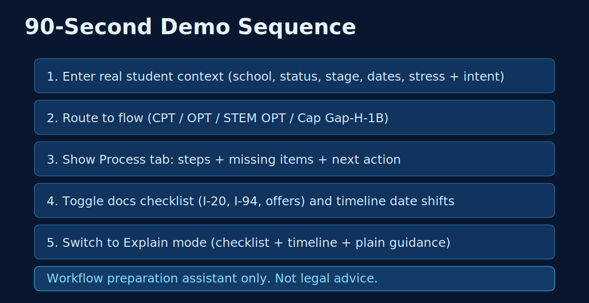
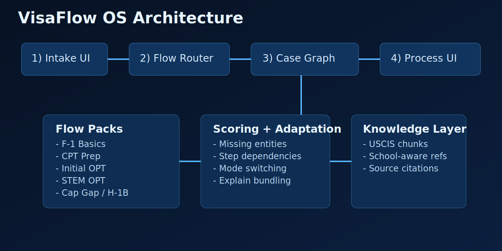
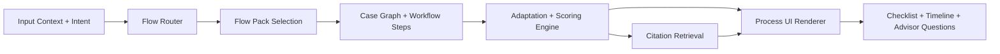
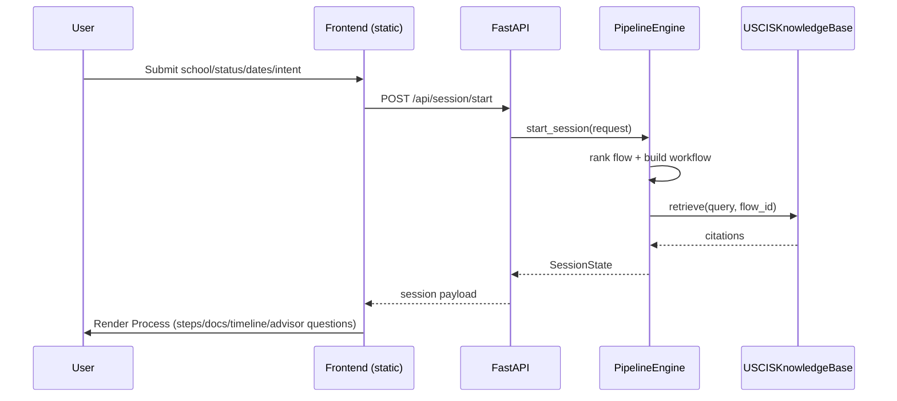

# VisaFlow OS

Adaptive, school-agnostic visa workflow interface for F-1 students and transition scenarios (CPT, OPT, STEM OPT, Cap Gap/H-1B).



## Why this exists
Visa and work-authorization workflows are high-stakes, but current interfaces are often static, jargon-heavy, and hard to complete correctly under stress.

**VisaFlow OS** modernizes this experience with a dynamic interface that:
- captures context in one input pass,
- routes users to the right flow,
- adapts process guidance in real time,
- generates timeline + docs checklist + advisor questions in one place.

## Hackathon challenge alignment (Future Interfaces)
This project directly addresses the challenge requirements:

- **Dynamically-generated UI**: flow, steps, and required fields are rendered from flow-pack data.
- **User-adaptive behavior**: mode switching (`checklist`, `timeline`, `explain`) adapts by context and interaction.
- **Legacy modernization**: dense workflow complexity is transformed into a guided, completion-focused interface.
- **Real-time understanding/completion response**: backend scoring/adaptation is used to drive clearer next steps.

## Product overview

### Input tab (one-shot context capture)
Users provide all key context in one go:
- school / university (not UCSD-specific)
- current status (`F-1`, `CPT`, `OPT`, `STEM OPT`, `H-1B Context`, `Cap Gap Context`)
- program stage, stress level, major/program
- program/graduation/job timeline dates
- employer and petition context
- plain-language intent

### Process tab (actionable guidance)
Users get:
- step-by-step workflow with dependency-aware status
- docs checklist (I-20, I-94, passport, admission/offer docs, flow-specific docs)
- advisor question list generated from missing/context signals
- timeline generated from job start date (example: CPT prep milestone at **10 days before start**)
- explain mode with checklist + timeline + plain guidance bundled together



## Architecture





### Runtime pipeline


## Repository structure

```text
app/
  main.py                     # FastAPI app + API routes
  models.py                   # Pydantic contracts/session state
  state.py                    # in-memory session store
  pipeline/
    engine.py                 # orchestration core
    flow_packs.py             # routing + case-graph construction
    adaptation.py             # mode adaptation
    scoring.py                # understanding/clarity/completeness/escalation
    workflow.py               # dependency + missing-item logic
    checks.py                 # micro-check logic
    packet.py                 # packet generation
    uscis_knowledge.py        # retrieval over source chunks

static/
  index.html                  # 2-tab UX (Input, Process)
  styles.css                  # dark UI theme
  app.js                      # client state + interactions

data/
  flows/*.json                # CPT/OPT/STEM/CapGap flow packs
  shared/*.json               # doc types, checks, glossary
  scenarios/demo_cases.json   # synthetic demo personas
  knowledge_chunks.json       # retrieval chunks
```

## Data sources and authenticity
- Grounding data comes from USCIS-oriented source chunks and curated flow-pack structures.
- School-specific content is context-aware: UCSD references are only included when school context indicates UCSD.
- For demo reliability, synthetic scenarios are included in `data/scenarios/demo_cases.json`.

## Supported flows
- F-1 Work Basics
- CPT Preparation
- Initial OPT Preparation
- STEM OPT Preparation
- Cap Gap / H-1B Transition Preparation

## API surface
- `GET /api/health`
- `GET /api/sources`
- `GET /api/flows`
- `GET /api/scenarios`
- `POST /api/session/start`
- `GET /api/session/{session_id}`
- `POST /api/session/{session_id}/event`
- `POST /api/session/{session_id}/micro-check`
- `POST /api/session/{session_id}/packet`

## Local setup

### 1) Install
```bash
python3 -m venv .venv
source .venv/bin/activate
pip install -r requirements.txt
```

### 2) Build KB chunks (optional refresh)
```bash
python3 scripts/build_uscis_kb.py
```

### 3) Run
```bash
uvicorn app.main:app --host 127.0.0.1 --port 8000 --reload
```

Open: [http://127.0.0.1:8000](http://127.0.0.1:8000)

## Demo script (judge/investor ready)
1. Open Input tab and choose a quick-start scenario (or type a custom case).
2. Show all-one-go context intake (school + status + dates + stress).
3. Generate plan and switch to Process tab.
4. Highlight workflow status + missing items + next action.
5. Toggle docs checklist items and show updated readiness.
6. Show timeline generated from job start date (including CPT -10 day milestone).
7. Switch to Explain mode to show combined checklist + timeline + plain guidance.
8. Close with disclaimer and advisor-verification positioning.

## Example status behavior
- `CPT` status routes strongly toward CPT prep.
- `H-1B Context` and `Cap Gap Context` route toward transition prep with petition-state emphasis.
- Ambiguous cases trigger disambiguation cards.

## Quality checks used for this branch
- Backend modules compile successfully.
- API session lifecycle tested (`start -> event -> process render data`).
- Updated status mappings tested (`cpt`, `h1b`, `cap_gap`).
- Timeline generation validated with date offsets.

## Disclaimer
This project is a **workflow-preparation assistant**, not legal advice. Users should verify case-specific actions with their international office and/or qualified immigration counsel.
